  

# Faraone

⚙️ Low-latency systems engineer building execution infrastructure, deterministic engines, and protocol/security tooling.

🧠 This profile is a compact map of systems built around measurable performance, replayability, testing, and real implementation depth.

## Focus

- Low-latency parsing, normalization, and signal generation
- Deterministic trading infrastructure and replayable state machines
- Multi-language execution stacks with explicit hot paths
- Protocol, wallet, and smart contract security systems

## Systems

| Project | What it is | Stack | Proof |
|---|---|---|---|
| **ZEUS Engine** | Engine core extracted from a proprietary FX trading system: FIX parse → normalize → order book update → signal generation | Rust 1.93, Zig 0.13, C++20, ISPC | **48.2ns** V14 fused no-timestamp, **53.4ns** fused with timestamp, **18x** faster than 858ns baseline, **14 optimization iterations** |
| **Atomic Mesh** | Distributed deterministic HFT market-making engine with event sourcing, replay, live dashboard, and C++ hot path | Rust, C++17, QUIC | **431ns** strategy compute, **92 tests**, live Binance integration, deterministic replay + state hash verification |
| **MEV Protocol** | Low-latency multi-language execution pipeline for real-time transaction processing on Arbitrum | Go, Rust, C, Solidity | **~608ns** full internal pipeline, **240+ tests**, **7 benchmark groups**, **40.7ns/op** Go tx classification |
| **REVERSO** | Reversible transfer protocol with time-locked transfers, recovery paths, monitor contracts, and enterprise API | Solidity, TypeScript, Node.js | **109 tests**, **13,000+ fuzz runs**, **7 chains live**, **3 verified contracts** on Ethereum |
| **SENTINEL** | Multi-chain wallet approval scanner with decompilation, heuristic analysis, and one-click revoke | Go, Rust, Python, React, Solidity | **16 EVM chains**, **30+ vulnerability patterns**, Redis/Postgres-backed API, Prometheus metrics |
| **Sky-Scraper** | Large-scale smart contract security scanner with layered exploit analysis pipeline | Rust | **52 crates**, **51 engines**, **12 layers**, **1314 patterns**, **~99% precision**, **50+ exploit templates** |

## Verification

- **ZEUS Engine:** benchmarked optimization path from **858ns** baseline to **48.2ns** current best fused pipeline
- **Atomic Mesh:** **92 passing tests** across **12 crates**, event-sourced replay and deterministic state verification
- **MEV Protocol:** **240+ tests**, **7 benchmark groups**, explicit latency budget showing network vs internal compute costs
- **REVERSO:** **109 passing tests** plus **13,000+ fuzz runs** with live multi-chain deployments
- **Sky-Scraper:** benchmarked on **70 production contracts / 1029 known vulnerabilities** with **1314 findings**

## Stack

**Core systems:** `Rust` `C++` `Zig` `Go`

**Protocol / product / tooling:** `TypeScript` `Solidity` `Python` `C`

`low-latency` `deterministic replay` `FFI hot paths` `concurrency` `protocol security` `observability`

## Current Focus

🚀 Building execution-grade systems with deterministic behavior, realistic constraints, and public technical proof.

## Links

- LinkedIn: [Ivan Piardi](https://ch.linkedin.com/in/ivan-piardi-33465a3a9)
- Best repo to start from: [ZEUS-HFT-public](https://github.com/Faraone-Dev/ZEUS-HFT-public)
- Contact: [LinkedIn](https://ch.linkedin.com/in/ivan-piardi-33465a3a9)

